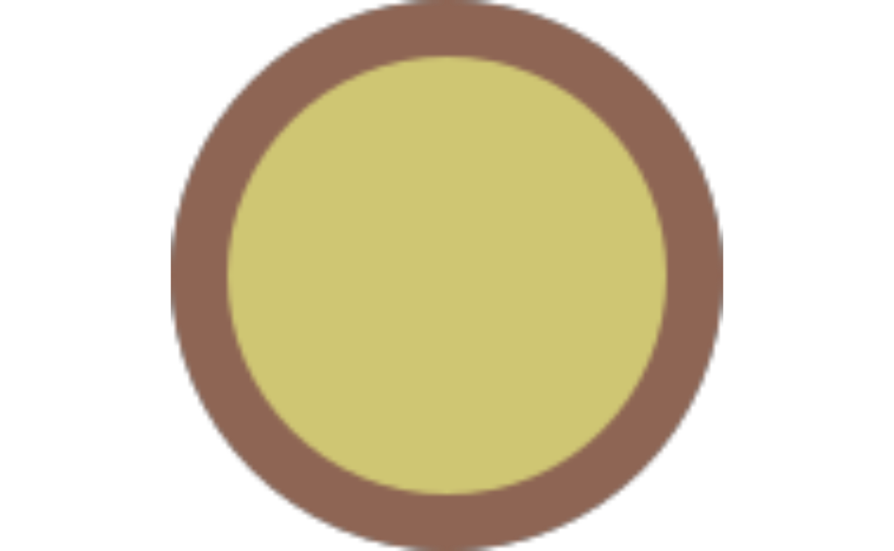
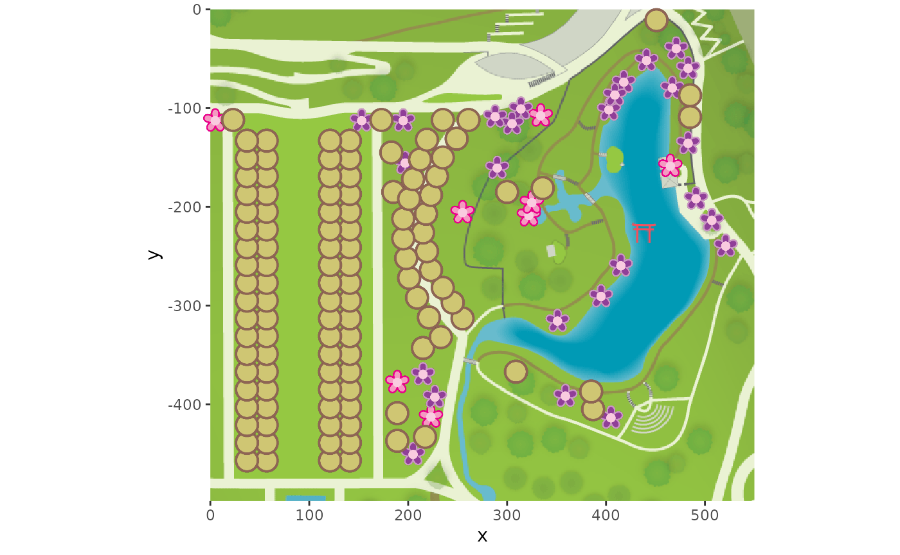

# Plot cherry blossom bloom statuses

``` r
library(bbggplots)
library(dplyr)
```

    ## 
    ## Attaching package: 'dplyr'

    ## The following objects are masked from 'package:stats':
    ## 
    ##     filter, lag

    ## The following objects are masked from 'package:base':
    ## 
    ##     intersect, setdiff, setequal, union

``` r
library(ggplot2)
library(ggsvg)
library(ggpubr)
```

``` r
firstbloom_svg <-
    system.file("extdata", "cherry-firstbloom.svg", package="bbggplots") |>
    readLines(warn = FALSE) |>
    paste(collapse = "\n")
peakbloom_svg <-
    system.file("extdata", "cherry-peakbloom.svg", package="bbggplots") |>
    readLines(warn = FALSE) |>
    paste(collapse = "\n")
postbloom_svg <-
    system.file("extdata", "cherry-postbloom.svg", package="bbggplots") |>
    readLines(warn = FALSE) |>
    paste(collapse = "\n")
prebloom_svg <-
    system.file("extdata", "cherry-prebloom.svg", package="bbggplots") |>
    readLines(warn = FALSE) |>
    paste(collapse = "\n")
bg <-
    system.file("extdata", "cherrymap.png", package="bbggplots") |>
    png::readPNG()
```

``` r
grid::grid.draw(svg_to_rasterGrob(firstbloom_svg))
```


``` r
grid::grid.draw(svg_to_rasterGrob(peakbloom_svg))
```


``` r
grid::grid.draw(svg_to_rasterGrob(postbloom_svg))
```


``` r
grid::grid.draw(svg_to_rasterGrob(prebloom_svg))
```



``` r
icons_df <- data.frame(
  bloom = c('Prebloom', 'First Bloom', 'Peak Bloom', 'Post Bloom'),
  svg  = c( prebloom_svg, firstbloom_svg, peakbloom_svg, postbloom_svg),
  stringsAsFactors = FALSE
)
```

``` r
p_size <- 5
bg_dim <- dim(bg)
bbgdata |>
    filter(date == "2025-04-14") |>
    mutate(id = as.character(id)) |>
    left_join(treepositions, by = join_by(tree == tree, id == id)) |>
    mutate(
        x = (left / 100 * bg_dim[2]) + p_size,
        y = (-top / 100 * bg_dim[1]) - p_size
    ) |>
    merge(icons_df) |>
    ggplot() +
    background_image(bg) +
    geom_point_svg(
        aes(x = x, y = y, svg = I(svg)),
        size = p_size
    ) + 
    scale_x_continuous(
        expand = c(0, 0),
        limits = c(0, 550)
    ) +
    scale_y_continuous(
        expand = c(0, 0),
        limits = c(0, -498)
    ) +
    # Maintain 1:1 ratio and allow drawing outside limits
    coord_fixed(clip = "off")
```



``` r
    theme_minimal()
```

    ## <theme> List of 144
    ##  $ line                            : <ggplot2::element_line>
    ##   ..@ colour       : chr "black"
    ##   ..@ linewidth    : num 0.5
    ##   ..@ linetype     : num 1
    ##   ..@ lineend      : chr "butt"
    ##   ..@ linejoin     : chr "round"
    ##   ..@ arrow        : logi FALSE
    ##   ..@ arrow.fill   : chr "black"
    ##   ..@ inherit.blank: logi TRUE
    ##  $ rect                            : <ggplot2::element_rect>
    ##   ..@ fill         : chr "white"
    ##   ..@ colour       : chr "black"
    ##   ..@ linewidth    : num 0.5
    ##   ..@ linetype     : num 1
    ##   ..@ linejoin     : chr "round"
    ##   ..@ inherit.blank: logi TRUE
    ##  $ text                            : <ggplot2::element_text>
    ##   ..@ family       : chr ""
    ##   ..@ face         : chr "plain"
    ##   ..@ italic       : chr NA
    ##   ..@ fontweight   : num NA
    ##   ..@ fontwidth    : num NA
    ##   ..@ colour       : chr "black"
    ##   ..@ size         : num 11
    ##   ..@ hjust        : num 0.5
    ##   ..@ vjust        : num 0.5
    ##   ..@ angle        : num 0
    ##   ..@ lineheight   : num 0.9
    ##   ..@ margin       : <ggplot2::margin> num [1:4] 0 0 0 0
    ##   ..@ debug        : logi FALSE
    ##   ..@ inherit.blank: logi TRUE
    ##  $ title                           : <ggplot2::element_text>
    ##   ..@ family       : NULL
    ##   ..@ face         : NULL
    ##   ..@ italic       : chr NA
    ##   ..@ fontweight   : num NA
    ##   ..@ fontwidth    : num NA
    ##   ..@ colour       : NULL
    ##   ..@ size         : NULL
    ##   ..@ hjust        : NULL
    ##   ..@ vjust        : NULL
    ##   ..@ angle        : NULL
    ##   ..@ lineheight   : NULL
    ##   ..@ margin       : NULL
    ##   ..@ debug        : NULL
    ##   ..@ inherit.blank: logi TRUE
    ##  $ point                           : <ggplot2::element_point>
    ##   ..@ colour       : chr "black"
    ##   ..@ shape        : num 19
    ##   ..@ size         : num 1.5
    ##   ..@ fill         : chr "white"
    ##   ..@ stroke       : num 0.5
    ##   ..@ inherit.blank: logi TRUE
    ##  $ polygon                         : <ggplot2::element_polygon>
    ##   ..@ fill         : chr "white"
    ##   ..@ colour       : chr "black"
    ##   ..@ linewidth    : num 0.5
    ##   ..@ linetype     : num 1
    ##   ..@ linejoin     : chr "round"
    ##   ..@ inherit.blank: logi TRUE
    ##  $ geom                            : <ggplot2::element_geom>
    ##   ..@ ink        : chr "black"
    ##   ..@ paper      : chr "white"
    ##   ..@ accent     : chr "#3366FF"
    ##   ..@ linewidth  : num 0.5
    ##   ..@ borderwidth: num 0.5
    ##   ..@ linetype   : int 1
    ##   ..@ bordertype : int 1
    ##   ..@ family     : chr ""
    ##   ..@ fontsize   : num 3.87
    ##   ..@ pointsize  : num 1.5
    ##   ..@ pointshape : num 19
    ##   ..@ colour     : NULL
    ##   ..@ fill       : NULL
    ##  $ spacing                         : 'simpleUnit' num 5.5points
    ##   ..- attr(*, "unit")= int 8
    ##  $ margins                         : <ggplot2::margin> num [1:4] 5.5 5.5 5.5 5.5
    ##  $ aspect.ratio                    : NULL
    ##  $ axis.title                      : NULL
    ##  $ axis.title.x                    : <ggplot2::element_text>
    ##   ..@ family       : NULL
    ##   ..@ face         : NULL
    ##   ..@ italic       : chr NA
    ##   ..@ fontweight   : num NA
    ##   ..@ fontwidth    : num NA
    ##   ..@ colour       : NULL
    ##   ..@ size         : NULL
    ##   ..@ hjust        : NULL
    ##   ..@ vjust        : num 1
    ##   ..@ angle        : NULL
    ##   ..@ lineheight   : NULL
    ##   ..@ margin       : <ggplot2::margin> num [1:4] 2.75 0 0 0
    ##   ..@ debug        : NULL
    ##   ..@ inherit.blank: logi TRUE
    ##  $ axis.title.x.top                : <ggplot2::element_text>
    ##   ..@ family       : NULL
    ##   ..@ face         : NULL
    ##   ..@ italic       : chr NA
    ##   ..@ fontweight   : num NA
    ##   ..@ fontwidth    : num NA
    ##   ..@ colour       : NULL
    ##   ..@ size         : NULL
    ##   ..@ hjust        : NULL
    ##   ..@ vjust        : num 0
    ##   ..@ angle        : NULL
    ##   ..@ lineheight   : NULL
    ##   ..@ margin       : <ggplot2::margin> num [1:4] 0 0 2.75 0
    ##   ..@ debug        : NULL
    ##   ..@ inherit.blank: logi TRUE
    ##  $ axis.title.x.bottom             : NULL
    ##  $ axis.title.y                    : <ggplot2::element_text>
    ##   ..@ family       : NULL
    ##   ..@ face         : NULL
    ##   ..@ italic       : chr NA
    ##   ..@ fontweight   : num NA
    ##   ..@ fontwidth    : num NA
    ##   ..@ colour       : NULL
    ##   ..@ size         : NULL
    ##   ..@ hjust        : NULL
    ##   ..@ vjust        : num 1
    ##   ..@ angle        : num 90
    ##   ..@ lineheight   : NULL
    ##   ..@ margin       : <ggplot2::margin> num [1:4] 0 2.75 0 0
    ##   ..@ debug        : NULL
    ##   ..@ inherit.blank: logi TRUE
    ##  $ axis.title.y.left               : NULL
    ##  $ axis.title.y.right              : <ggplot2::element_text>
    ##   ..@ family       : NULL
    ##   ..@ face         : NULL
    ##   ..@ italic       : chr NA
    ##   ..@ fontweight   : num NA
    ##   ..@ fontwidth    : num NA
    ##   ..@ colour       : NULL
    ##   ..@ size         : NULL
    ##   ..@ hjust        : NULL
    ##   ..@ vjust        : num 1
    ##   ..@ angle        : num -90
    ##   ..@ lineheight   : NULL
    ##   ..@ margin       : <ggplot2::margin> num [1:4] 0 0 0 2.75
    ##   ..@ debug        : NULL
    ##   ..@ inherit.blank: logi TRUE
    ##  $ axis.text                       : <ggplot2::element_text>
    ##   ..@ family       : NULL
    ##   ..@ face         : NULL
    ##   ..@ italic       : chr NA
    ##   ..@ fontweight   : num NA
    ##   ..@ fontwidth    : num NA
    ##   ..@ colour       : chr "#4D4D4DFF"
    ##   ..@ size         : 'rel' num 0.8
    ##   ..@ hjust        : NULL
    ##   ..@ vjust        : NULL
    ##   ..@ angle        : NULL
    ##   ..@ lineheight   : NULL
    ##   ..@ margin       : NULL
    ##   ..@ debug        : NULL
    ##   ..@ inherit.blank: logi TRUE
    ##  $ axis.text.x                     : <ggplot2::element_text>
    ##   ..@ family       : NULL
    ##   ..@ face         : NULL
    ##   ..@ italic       : chr NA
    ##   ..@ fontweight   : num NA
    ##   ..@ fontwidth    : num NA
    ##   ..@ colour       : NULL
    ##   ..@ size         : NULL
    ##   ..@ hjust        : NULL
    ##   ..@ vjust        : num 1
    ##   ..@ angle        : NULL
    ##   ..@ lineheight   : NULL
    ##   ..@ margin       : <ggplot2::margin> num [1:4] 2.2 0 0 0
    ##   ..@ debug        : NULL
    ##   ..@ inherit.blank: logi TRUE
    ##  $ axis.text.x.top                 : <ggplot2::element_text>
    ##   ..@ family       : NULL
    ##   ..@ face         : NULL
    ##   ..@ italic       : chr NA
    ##   ..@ fontweight   : num NA
    ##   ..@ fontwidth    : num NA
    ##   ..@ colour       : NULL
    ##   ..@ size         : NULL
    ##   ..@ hjust        : NULL
    ##   ..@ vjust        : NULL
    ##   ..@ angle        : NULL
    ##   ..@ lineheight   : NULL
    ##   ..@ margin       : <ggplot2::margin> num [1:4] 0 0 4.95 0
    ##   ..@ debug        : NULL
    ##   ..@ inherit.blank: logi TRUE
    ##  $ axis.text.x.bottom              : <ggplot2::element_text>
    ##   ..@ family       : NULL
    ##   ..@ face         : NULL
    ##   ..@ italic       : chr NA
    ##   ..@ fontweight   : num NA
    ##   ..@ fontwidth    : num NA
    ##   ..@ colour       : NULL
    ##   ..@ size         : NULL
    ##   ..@ hjust        : NULL
    ##   ..@ vjust        : NULL
    ##   ..@ angle        : NULL
    ##   ..@ lineheight   : NULL
    ##   ..@ margin       : <ggplot2::margin> num [1:4] 4.95 0 0 0
    ##   ..@ debug        : NULL
    ##   ..@ inherit.blank: logi TRUE
    ##  $ axis.text.y                     : <ggplot2::element_text>
    ##   ..@ family       : NULL
    ##   ..@ face         : NULL
    ##   ..@ italic       : chr NA
    ##   ..@ fontweight   : num NA
    ##   ..@ fontwidth    : num NA
    ##   ..@ colour       : NULL
    ##   ..@ size         : NULL
    ##   ..@ hjust        : num 1
    ##   ..@ vjust        : NULL
    ##   ..@ angle        : NULL
    ##   ..@ lineheight   : NULL
    ##   ..@ margin       : <ggplot2::margin> num [1:4] 0 2.2 0 0
    ##   ..@ debug        : NULL
    ##   ..@ inherit.blank: logi TRUE
    ##  $ axis.text.y.left                : <ggplot2::element_text>
    ##   ..@ family       : NULL
    ##   ..@ face         : NULL
    ##   ..@ italic       : chr NA
    ##   ..@ fontweight   : num NA
    ##   ..@ fontwidth    : num NA
    ##   ..@ colour       : NULL
    ##   ..@ size         : NULL
    ##   ..@ hjust        : NULL
    ##   ..@ vjust        : NULL
    ##   ..@ angle        : NULL
    ##   ..@ lineheight   : NULL
    ##   ..@ margin       : <ggplot2::margin> num [1:4] 0 4.95 0 0
    ##   ..@ debug        : NULL
    ##   ..@ inherit.blank: logi TRUE
    ##  $ axis.text.y.right               : <ggplot2::element_text>
    ##   ..@ family       : NULL
    ##   ..@ face         : NULL
    ##   ..@ italic       : chr NA
    ##   ..@ fontweight   : num NA
    ##   ..@ fontwidth    : num NA
    ##   ..@ colour       : NULL
    ##   ..@ size         : NULL
    ##   ..@ hjust        : NULL
    ##   ..@ vjust        : NULL
    ##   ..@ angle        : NULL
    ##   ..@ lineheight   : NULL
    ##   ..@ margin       : <ggplot2::margin> num [1:4] 0 0 0 4.95
    ##   ..@ debug        : NULL
    ##   ..@ inherit.blank: logi TRUE
    ##  $ axis.text.theta                 : NULL
    ##  $ axis.text.r                     : <ggplot2::element_text>
    ##   ..@ family       : NULL
    ##   ..@ face         : NULL
    ##   ..@ italic       : chr NA
    ##   ..@ fontweight   : num NA
    ##   ..@ fontwidth    : num NA
    ##   ..@ colour       : NULL
    ##   ..@ size         : NULL
    ##   ..@ hjust        : num 0.5
    ##   ..@ vjust        : NULL
    ##   ..@ angle        : NULL
    ##   ..@ lineheight   : NULL
    ##   ..@ margin       : <ggplot2::margin> num [1:4] 0 2.2 0 2.2
    ##   ..@ debug        : NULL
    ##   ..@ inherit.blank: logi TRUE
    ##  $ axis.ticks                      : <ggplot2::element_blank>
    ##  $ axis.ticks.x                    : NULL
    ##  $ axis.ticks.x.top                : NULL
    ##  $ axis.ticks.x.bottom             : NULL
    ##  $ axis.ticks.y                    : NULL
    ##  $ axis.ticks.y.left               : NULL
    ##  $ axis.ticks.y.right              : NULL
    ##  $ axis.ticks.theta                : NULL
    ##  $ axis.ticks.r                    : NULL
    ##  $ axis.minor.ticks.x.top          : NULL
    ##  $ axis.minor.ticks.x.bottom       : NULL
    ##  $ axis.minor.ticks.y.left         : NULL
    ##  $ axis.minor.ticks.y.right        : NULL
    ##  $ axis.minor.ticks.theta          : NULL
    ##  $ axis.minor.ticks.r              : NULL
    ##  $ axis.ticks.length               : 'rel' num 0.5
    ##  $ axis.ticks.length.x             : NULL
    ##  $ axis.ticks.length.x.top         : NULL
    ##  $ axis.ticks.length.x.bottom      : NULL
    ##  $ axis.ticks.length.y             : NULL
    ##  $ axis.ticks.length.y.left        : NULL
    ##  $ axis.ticks.length.y.right       : NULL
    ##  $ axis.ticks.length.theta         : NULL
    ##  $ axis.ticks.length.r             : NULL
    ##  $ axis.minor.ticks.length         : 'rel' num 0.75
    ##  $ axis.minor.ticks.length.x       : NULL
    ##  $ axis.minor.ticks.length.x.top   : NULL
    ##  $ axis.minor.ticks.length.x.bottom: NULL
    ##  $ axis.minor.ticks.length.y       : NULL
    ##  $ axis.minor.ticks.length.y.left  : NULL
    ##  $ axis.minor.ticks.length.y.right : NULL
    ##  $ axis.minor.ticks.length.theta   : NULL
    ##  $ axis.minor.ticks.length.r       : NULL
    ##  $ axis.line                       : <ggplot2::element_blank>
    ##  $ axis.line.x                     : NULL
    ##  $ axis.line.x.top                 : NULL
    ##  $ axis.line.x.bottom              : NULL
    ##  $ axis.line.y                     : NULL
    ##  $ axis.line.y.left                : NULL
    ##  $ axis.line.y.right               : NULL
    ##  $ axis.line.theta                 : NULL
    ##  $ axis.line.r                     : NULL
    ##  $ legend.background               : <ggplot2::element_blank>
    ##  $ legend.margin                   : NULL
    ##  $ legend.spacing                  : 'rel' num 2
    ##  $ legend.spacing.x                : NULL
    ##  $ legend.spacing.y                : NULL
    ##  $ legend.key                      : <ggplot2::element_blank>
    ##  $ legend.key.size                 : 'simpleUnit' num 1.2lines
    ##   ..- attr(*, "unit")= int 3
    ##  $ legend.key.height               : NULL
    ##  $ legend.key.width                : NULL
    ##  $ legend.key.spacing              : NULL
    ##  $ legend.key.spacing.x            : NULL
    ##  $ legend.key.spacing.y            : NULL
    ##  $ legend.key.justification        : NULL
    ##  $ legend.frame                    : NULL
    ##  $ legend.ticks                    : NULL
    ##  $ legend.ticks.length             : 'rel' num 0.2
    ##  $ legend.axis.line                : NULL
    ##  $ legend.text                     : <ggplot2::element_text>
    ##   ..@ family       : NULL
    ##   ..@ face         : NULL
    ##   ..@ italic       : chr NA
    ##   ..@ fontweight   : num NA
    ##   ..@ fontwidth    : num NA
    ##   ..@ colour       : NULL
    ##   ..@ size         : 'rel' num 0.8
    ##   ..@ hjust        : NULL
    ##   ..@ vjust        : NULL
    ##   ..@ angle        : NULL
    ##   ..@ lineheight   : NULL
    ##   ..@ margin       : NULL
    ##   ..@ debug        : NULL
    ##   ..@ inherit.blank: logi TRUE
    ##  $ legend.text.position            : NULL
    ##  $ legend.title                    : <ggplot2::element_text>
    ##   ..@ family       : NULL
    ##   ..@ face         : NULL
    ##   ..@ italic       : chr NA
    ##   ..@ fontweight   : num NA
    ##   ..@ fontwidth    : num NA
    ##   ..@ colour       : NULL
    ##   ..@ size         : NULL
    ##   ..@ hjust        : num 0
    ##   ..@ vjust        : NULL
    ##   ..@ angle        : NULL
    ##   ..@ lineheight   : NULL
    ##   ..@ margin       : NULL
    ##   ..@ debug        : NULL
    ##   ..@ inherit.blank: logi TRUE
    ##  $ legend.title.position           : NULL
    ##  $ legend.position                 : chr "right"
    ##  $ legend.position.inside          : NULL
    ##  $ legend.direction                : NULL
    ##  $ legend.byrow                    : NULL
    ##  $ legend.justification            : chr "center"
    ##  $ legend.justification.top        : NULL
    ##  $ legend.justification.bottom     : NULL
    ##  $ legend.justification.left       : NULL
    ##  $ legend.justification.right      : NULL
    ##  $ legend.justification.inside     : NULL
    ##   [list output truncated]
    ##  @ complete: logi TRUE
    ##  @ validate: logi TRUE
